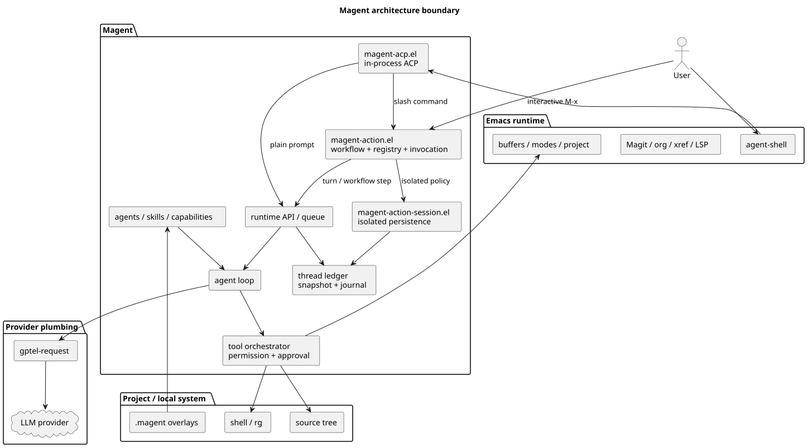

#+TITLE: Magent - AI Coding Agent for Emacs
#+OPTIONS: toc:2 num:nil

[[https://github.com/Jamie-Cui/magent/actions/workflows/test.yml][https://github.com/Jamie-Cui/magent/actions/workflows/test.yml/badge.svg]]
[[https://github.com/Jamie-Cui/magent/actions/workflows/coverage.yml][https://github.com/Jamie-Cui/magent/actions/workflows/coverage.yml/badge.svg]]
[[https://github.com/Jamie-Cui/magent/actions/workflows/melpazoid.yml][https://github.com/Jamie-Cui/magent/actions/workflows/melpazoid.yml/badge.svg]]

An Emacs Lisp AI coding agent with multi-agent architecture, permission-based
tool access, an Elisp-native slash-command extension API through
~magent-action~, and LLM integration via [[https://github.com/karthink/gptel][gptel]].

homepage: https://jamie-cui.github.io/magent/

* Releases

Magent follows Semantic Versioning.  See [[file:CHANGELOG.org][CHANGELOG.org]] for release history and
current development status, and [[file:docs/RELEASING.org][docs/RELEASING.org]] for the versioning policy,
public compatibility boundary, and release checklist.

* Agent Workflow

Magent now uses a durable child-agent lifecycle for collaborative agent work: spawn, message, wait, list, resume/inspect, and close. The lifecycle is implemented on top of the Magent-owned agent loop while provider integration stays with ~gptel-request~.

#+CAPTION: Magent architecture boundary with agent-shell and explicit command entry paths

See [[file:docs/UI_BACKENDS.org][docs/UI_BACKENDS.org]] for the supported agent-shell frontend boundary.

* ~magent-action~ vs Skills in Emacs

~magent-action~ and skills are complementary extension points, not two ways to
define the same thing:

|                        | ~magent-action~                                                        | Skill                                                            |
|------------------------+-----------------------------------------------------------------------+------------------------------------------------------------------|
| Primary role           | An explicit Emacs or slash-command action                             | Reusable model instructions                                      |
| Definition             | Trusted Elisp registered with ~magent-action-register~                 | A data-only ~SKILL.md~ file                                        |
| Activation             | The user enters ~/name~ or runs ~M-x magent-agent-shell-run-command~      | The user enters ~/$name~, selects it, or a capability activates it |
| Owns                   | Arguments, requirements, session policy, Steps, and multi-step control | Model context and workflow guidance                              |
| Project trust boundary | Action Workflows are trusted installed Elisp                          | Project skill Markdown never executes code                       |

Use ~magent-action~ when you want a stable, user-triggered entry point in
Emacs.  Use a skill when you want reusable expertise that the agent can apply
while handling requests. Use both when an explicit Action
should activate reusable expertise: an agent Step can select skills with
~:skills~ and expose its exact provider tool set with ~:tools~.

ACP advertises every visible instruction skill as ~/$name~ in agent-shell.
Skills are never projected into the Action registry: ~/$name~ selects
instruction data for one ordinary turn, while ~/name~ invokes a registered
Action. Markdown never receives trusted Elisp execution authority.

~magent-action~ therefore makes slash commands first-class, explicit user
actions.  Your init file or another trusted Elisp package can register an Action
through the public ~magent-action-register~ API without changing the agent-shell
or ACP integration. Every Action owns one generator-backed Elisp Workflow;
managed agent, process, and callback Steps provide asynchronous suspension,
cancellation, progress, and activity recording.

Registered commands are advertised to agent-shell and can be invoked as slash
input or selected with ~M-x magent-agent-shell-run-command~.  The complete
~use-package~ example below registers ~/ask-name~; see
[[file:docs/COMMANDS.org][docs/COMMANDS.org]] for the full command API and lifecycle.

* Requirements

- Emacs 29.1+
- [[https://github.com/karthink/gptel][gptel]] 0.9.8+
- [[https://elpa.gnu.org/packages/compat.html][compat]] 30.1+
- [[https://elpa.gnu.org/packages/yaml.html][yaml]] 1.0+
- acp 0.13.1+
- agent-shell 0.66.1+
- [[https://github.com/BurntSushi/ripgrep][ripgrep]] (for the ~grep~ tool)

* Installation

** Manual Installation

Add the project to your Emacs load path:

#+begin_src elisp
(add-to-list 'load-path "/path/to/magent/lisp")
(require 'magent)
(magent-agent-shell-ensure-config)
#+end_src

** Using ~use-package~

#+begin_src elisp
(use-package magent
  :load-path "/path/to/magent/lisp"
  :config
  (magent-agent-shell-ensure-config))
#+end_src

** Installing from Git with ~use-package~

When your ~use-package~ supports the ~:vc~ keyword, it can install and load
Magent directly from Git.  Magent stores its Emacs Lisp sources under
~lisp/~, so keep the explicit ~:lisp-dir~ entry in the VC package
specification:

#+begin_src elisp
(use-package magent
  :vc (:url "https://github.com/Jamie-Cui/magent"
       :rev "master"
       :lisp-dir "lisp")
  :ensure t
  :after (agent-shell gptel)
  :demand t
  :custom
  ;; Uncomment to bypass ordinary checks; eval tools still require approval.
  ;; (magent-bypass-permission t)
  (magent-default-effort 'xhigh)
  :config
  ;; Optional: append an additional personal skill directory.  Later entries
  ;; have higher precedence and become the skill manager's install target.
  (add-to-list 'magent-skill-directories
               (expand-file-name "skills" user-emacs-directory)
               t)

  (magent-agent-shell-ensure-config)

  ;; Register /ask-name as an Elisp-native Magent Action.
  (magent-define-workflow my-magent-ask-name (invocation)
    (let ((topic
           (string-trim
            (or (magent-action-invocation-argument invocation) ""))))
      (magent-workflow-answer
          "Ask selected agent"
          (if (string-empty-p topic)
              "What is your name?"
            (format "What is your name? Also discuss: %s" topic)))))

  (magent-action-register
   "ask-name"
   :description "Ask the selected Magent agent to introduce itself."
   :session-policy 'current
   :workflow #'my-magent-ask-name
   :source-layer 'user
   :requires 'subr-x))
#+end_src

~:requires~ accepts one Emacs feature or a list of features. Magent calls
~require~ during invocation preflight; it does not install packages or require
a project workspace. Tool requirements belong to the agent Step that needs
them. Every registration requires one ~:workflow~ and an explicit
~:session-policy~. A ~user~ command can override an installed ~package~ or
~builtin~ Action with the same name. Registering the same name, layer, and
canonical scope again replaces that slot's previous definition. The core
~/compact~ and ~/skills~ names remain reserved.

* Configuration

** Quick Start

Magent delegates all LLM communication to [[https://github.com/karthink/gptel][gptel]]. Configure your provider, model, and API key through gptel:

#+begin_src elisp
;; gptel handles provider/model/key configuration
(setq gptel-model 'claude-sonnet-4-20250514)
(setq gptel-api-key "sk-ant-...")  ; or use ANTHROPIC_API_KEY env var
#+end_src

See [[https://github.com/karthink/gptel#configuration][gptel documentation]] for full provider setup (Anthropic, OpenAI, Ollama, etc.).

The only supported Magent frontend is agent-shell.  Magent supplies its own
agent-shell configuration and in-process ACP client, so no external ACP
command is required.  To start using Magent:

1. Visit a file in the project you want Magent to work on.
2. Run ~M-x magent-start~.  Magent opens or reuses the project-local
   agent-shell buffer through its in-process ACP adapter.  A new buffer prompts
   you to start a new session or load a saved session from that project.  You
   can also run ~M-x agent-shell~ and select Magent after registering the
   configuration as shown in the installation examples above.
3. Type a prompt at the bottom of the agent-shell buffer and press ~RET~ to
   submit it.  Assistant responses, reasoning, tool calls, and permission
   requests are streamed into the same buffer.
4. Enter another prompt and press ~RET~ to continue the project-scoped session.
   While a request is running, press ~C-c C-c~ to interrupt it.

From a source buffer, ~M-x magent-agent-shell-prompt-region~ sends the active
region and ~M-x magent-agent-shell-ask-at-point~ asks about the symbol at point;
both commands submit their context through agent-shell.

** Magent-Specific Options

Customize with ~M-x customize-group RET magent RET~. Key settings:

| Option                                       | Default                             | Description                                                                                    |
|----------------------------------------------+-------------------------------------+------------------------------------------------------------------------------------------------|
| ~magent-system-prompt~                         | (built-in)                          | Default system prompt for agents                                                               |
| ~magent-enable-tools~                          | default tool set                    | Globally enabled tool permission groups                                                        |
| ~magent-project-root-function~                 | ~nil~                                 | Custom project root finder                                                                     |
| ~magent-max-history~                           | ~100~                                 | Max messages in history                                                                        |
| ~magent-request-timeout~                       | ~120~                                 | Timeout in seconds for LLM requests                                                            |
| ~magent-max-sampling-requests~                 | ~0~                                   | Continuation budget; reaching it fails the turn directly, and 0 disables the guard             |
| ~magent-default-agent~                         | ~"build"~                           | Default agent for new sessions                                                                 |
| ~magent-default-effort~                        | ~nil~                                 | Default reasoning effort; nil/auto uses provider default                                       |
| ~magent-agent-shell-session-strategy~          | ~prompt~                              | Prompt to start new or load a saved session; also supports ~new~ and ~latest~                     |
| ~magent-skill-directories~                     | ~user-emacs-directory/magent/skills/~ | Ordered user skill roots; later entries override earlier entries                               |
| ~magent-load-custom-agents~                    | ~t~                                   | Load custom agents from ~.magent/agent/*.md~                                                     |
| ~magent-audit~                                 | ~buffer~                              | Audit destination: live buffer, nil to disable, or a JSONL file path                            |
| ~magent-agent-directory~                       | ~".magent/agent"~                   | Relative path to custom agent dir                                                              |
| ~magent-session-directory~                     | =~/.emacs.d/magent/sessions/=         | Base directory for global sessions and per-project session subdirectories                      |
| ~magent-grep-program~                          | ~"rg"~                              | Path to ripgrep binary                                                                         |
| ~magent-grep-max-matches~                      | ~100~                                 | Max matches from grep searches                                                                 |
| ~magent-glob-max-results~                      | ~500~                                 | Maximum paths returned by one glob                                                             |
| ~magent-glob-max-files-scanned~                | ~50000~                               | Maximum filesystem entries inspected by one glob                                                |
| ~magent-glob-batch-size~                       | ~500~                                 | Filesystem entries processed per event-loop slice                                               |
| ~magent-bash-program~                          | ~"bash"~                            | Bash-compatible executable; commands use pipefail without implicit errexit                     |
| ~magent-bash-timeout~                          | ~300~                                 | Host-owned timeout in seconds for synchronous bash commands                                    |
| ~magent-child-agent-max-depth~                 | ~1~                                   | Max recursive child-agent depth; direct children are allowed by default                        |
| ~magent-emacs-eval-timeout~                    | ~10~                                  | Host-owned timeout for child eval; best-effort timeout for live eval                              |
| ~magent-emacs-read-max-characters~             | ~12000~                               | Maximum structured ~emacs_read~ result size                                                       |
| ~magent-tool-output-spill-session-max-bytes~   | ~67108864~                            | Maximum retained full tool-result bytes per session                                               |
| ~magent-tool-output-spill-ttl~                 | ~86400~                               | Lifetime in seconds for spilled full tool results                                                  |
| ~magent-tool-output-spill-page-characters~     | ~8000~                                | Maximum body characters returned by one ~read_tool_output~ page                                    |
| ~magent-enable-capabilities~                   | ~t~                                   | Enable contextual capability resolution by default                                             |
| ~magent-project-instruction-file-names~        | ~("AGENTS.md")~                       | Scoped project instruction filenames discovered from root toward request resources             |
| ~magent-project-instructions-max-bytes~        | ~65536~                               | Aggregate per-request byte limit for project instructions; nil disables discovery              |
| ~magent-audit-preview-length~                  | ~120~                                 | Max width for normalized audit path markers                                                    |
| ~magent-include-reasoning~                     | ~t~                                   | Display (~t~), hide but retain (~ignore~), or discard (~nil~) reasoning; never final-answer fallback |

** Prompt Files

Core, built-in agent, slash-command, and internal runtime prompts live as
editable Org files under ~prompts/~. Files containing placeholders such as
~{{project-root}}~ or ~{{instruction}}~ should keep those placeholders where
the dynamic value is needed; ordinary percent signs need no escaping. Skill
prompts remain self-contained in ~skills/*/SKILL.md~. Every bundled Org prompt
must appear exactly once in ~prompts/manifest.txt~.

* Usage

** Interactive Commands

| Command                                          | Description                                                      |
|--------------------------------------------------+------------------------------------------------------------------|
| ~magent-start~                                     | Open or reuse the project-local Magent agent-shell buffer        |
| ~magent-agent-shell-start~                         | Start a fresh Magent agent-shell buffer                          |
| ~magent-agent-shell-prompt-region~                 | Send the selected region through agent-shell                     |
| ~magent-agent-shell-ask-at-point~                  | Ask about the symbol at point through agent-shell                |
| ~magent-agent-shell-interrupt~                     | Interrupt the active Magent agent-shell request                  |
| ~magent-agent-shell-run-command~                   | Select and run a registered slash command                        |
| ~magent-agent-shell-toggle-skill-for-next-request~ | Toggle a one-shot instruction skill                              |
| ~magent-toggle-bypass-permission~                  | Toggle ordinary permission bypass; once-only eval approval remains |

Prompt text is entered directly in the agent-shell buffer, and Magent streams
assistant responses, tool activity, permission prompts, and session updates
back through agent-shell.

Use agent-shell session options for per-session request settings.  Reasoning
effort is exposed as agent-shell's thought level session option; use
~agent-shell-set-session-thought-level~ to choose ~auto~, ~minimal~, ~low~,
~medium~, ~high~, or ~xhigh~ for future turns in the current session. The
~Automatic capabilities~ session option enables or disables contextual skill
activation without affecting explicitly selected instruction skills.

Agent-shell file mentions use ACP structured resource blocks. Magent persists
those blocks with the turn and reconstructs their bodies as user-role context;
local file resources also select applicable project instructions from the
project root toward the attached file.

The same bypass state is also exposed as the customize option
~magent-bypass-permission~ under ~M-x customize-group RET magent RET~.

** Session Scope

Magent runtime state is scoped by project, and the supported agent-shell
workflow associates sessions with the current project:

- In a recognized project, prompts, agent selection, clear, and resume operate on that project's current session.
- Saved project sessions live under ~magent-session-directory/projects/<sha1(project-root)>/~.
- Outside any project, Magent falls back to the global session behavior and saves directly under ~magent-session-directory~.
- Permission decisions and sensitive tools are audited only in the live ~*magent-audit*~ buffer by default. Set ~magent-audit~ to nil to disable recording or to a file path to append JSONL records.

** Slash Commands And Skills

Instruction skills can be selected as one-shot context for the next request.
In agent-shell, use ~M-x magent-agent-shell-toggle-skill-for-next-request~ to
toggle a skill and ~M-x magent-agent-shell-clear-skills-for-next-request~ to
clear selected skills.  Selected skills are scoped to the active Magent session
and are consumed by the next prompt.

Elisp-native slash commands are registered through the public
~magent-action-register~ API and can be selected with
~M-x magent-agent-shell-run-command~. By default, agent-shell advertises twelve bundled
commands: ~/explain~, ~/fix~, ~/init~, ~/review~, ~/test~,
~/compact~, ~/authority~, ~/skills~, ~/doctor~, ~/memory-init~,
~/memory-refresh~, and ~/memory-clear~. The five prompt commands own package
Org resources and do not activate same-name skills.

Doctor and Memory are optional built-in Action groups. Customize
~magent-action-enabled-builtins~, or use ~setopt~, to change them at runtime:

#+begin_src elisp
;; Keep Doctor, but remove the three memory-management Actions.
(setopt magent-action-enabled-builtins '(doctor))
#+end_src

The Action registry and active agent-shell command menus update immediately;
an already running Action is allowed to finish. The ~memory~ entry controls
~/memory-init~, ~/memory-refresh~, and ~/memory-clear~ together. It does not
disable profile-memory injection, which is controlled separately by
~magent-memory-enable-auto-injection~.

Every instruction skill in the exact session scope is advertised as ~/$name~.
~/skills~ lists those descriptors locally. Submit ~/$name~ to select a skill
for one normal turn; submit ~/name~ or use
~M-x magent-agent-shell-run-command~ to invoke an Action. See
[[file:docs/COMMANDS.org][docs/COMMANDS.org]] for slash-command behavior and
the third-party Action API. Action definitions and skill descriptors are
resolved by canonical project scope, and agent-shell uses the exact session
scope for both menus and dispatch.

All skills are instruction-only and data-only. For executable extensions, use
a trusted Elisp command or add a first-class tool to Magent's canonical tool
catalog; companion Elisp next to ~SKILL.md~ is never loaded.

** User Skill Management

Use ~M-x magent-find-skill~ to search skills.sh.  The finder shows the ten
most-installed matches; ~RET~ previews a candidate, ~i~ installs it directly,
and ~g~ starts another search.  ~M-x magent-install-skill~ also accepts a local
skill directory, ~owner/repo@skill~, or a public GitHub URL.

Managed skills are copied into ~~/.emacs.d/magent/skills/<name>/~ by default.
Magent previews the source, size, file count, and any scripts or code before a
single ~y/n~ confirmation.  It installs instruction skills only, does not
execute copied scripts, and records provenance in ~.magent-install.json~.
~M-x magent-delete-skill~ permanently deletes a selected user-level skill after
one ~y/n~ confirmation.  These commands never manage project-local
~.magent/skills/~ or ~~/.agents/skills/~.

~magent-skill-directories~ is ordered: later directories take precedence when
skill names collide, and its final entry is the installation target used by the
skill manager.  Append a custom directory to retain the default roots while
making the custom directory the highest-priority source and installation
target:

#+begin_src elisp
(add-to-list 'magent-skill-directories "/path/to/skills" t)
#+end_src

* Agent System

Magent uses a multi-agent architecture where different agents have different capabilities and permissions.

** Built-in Agents

| Agent | Mode | Description |
|-------+------+-------------|
| ~build~ | primary | Default agent for general coding tasks with full tool access |
| ~plan~ | primary | Planning agent with restricted file edits (only ~.magent/plan/*.md~) |
| ~explore~ | subagent | Fast codebase exploration (read/grep/glob/bash only) |
| ~general~ | subagent | General-purpose subagent for child-agent tasks |
| ~compaction~ | primary (hidden) | Session summarization / conversation compaction |
| ~title~ | primary (hidden) | Conversation title generation |
| ~summary~ | primary (hidden) | Pull-request style summary generation |

** Agent Modes

- *primary*: User-facing agents that can be selected for sessions
- *subagent*: Internal agents called by primary agents for subtasks
- *all*: Can act as either primary or subagent

** Child-Agent Jobs

Primary agents can coordinate child agents through durable jobs. A root turn can call ~spawn_agent~ to start work under a subagent profile, use ~list_agents~ and ~wait_agent~ to monitor results, send follow-up input with ~send_agent_message~, and close work explicitly with ~close_agent~.

Child jobs are stored in the parent session under ~agent-jobs~ with status,
prompt, metadata, result/error, and transcript state. Agent-shell shows compact
lifecycle updates. See [[file:docs/AGENT_JOBS.org][docs/AGENT_JOBS.org]] for the implementation model and
boundaries.

** Permission System

Each agent has permission rules controlling tool access:

#+begin_src elisp
;; Example permission rules in an agent definition
'((read . allow)
  (write . (("*.env.example" . allow)
            ("*.env" . deny)
            ("*.key" . deny)
            (* . ask)))
  (bash . ask)
  (* . allow))
#+end_src

Permission actions:

- ~allow~: Tool is allowed
- ~deny~: Tool is blocked
- ~ask~: Prompt the user for confirmation

** Custom Agents

Create custom agents by adding markdown files to ~.magent/agent/~.

*Example: ~.magent/agent/reviewer.md~*

#+begin_src markdown
---
description: Code review specialist
mode: primary
hidden: false
temperature: 0.3
effort: high
permissions:
  read: allow
  write: deny
  bash: deny
  grep: allow
  glob: allow
---

You are a code review specialist. Analyze code for:
- Bugs and potential issues
- Code style and best practices
- Performance optimizations
- Security vulnerabilities

Provide constructive feedback with specific examples.
#+end_src

The YAML frontmatter supports:

- ~description~: Short description of the agent
- ~mode~: ~primary~, ~subagent~, or ~all~
- ~hidden~: Hide from agent selection UI
- ~temperature~: Override default temperature
- ~effort~: Override reasoning effort: ~auto~, ~minimal~, ~low~, ~medium~, ~high~, or ~xhigh~
- ~model~: Override default model
- ~permissions~: Mapping of permission groups to ~allow~, ~deny~, ~ask~, or nested file-pattern rules

Unknown frontmatter fields and non-canonical permission keys are rejected.

* Available Tools

The AI agent has access to these tools (can be customized per agent):

| Tool               | Side-effect | Description                                             |
|--------------------+-------------+---------------------------------------------------------|
| ~read_file~          | no          | Read explicit disk/live-buffer source and return revision |
| ~write_file~         | yes         | Revision-checked atomic write; rejects dirty buffers     |
| ~edit_file~          | yes         | Revision-checked exact replacement; rejects conflicts    |
| ~grep~               | no          | Regex search via ripgrep with per-file revisions         |
| ~glob~               | no          | Bounded, event-loop-sliced glob traversal               |
| ~bash~               | yes         | Execute shell commands (default timeout 300s)           |
| ~emacs_read~         | no          | Run fixed, bounded queries against the live Emacs       |
| ~emacs_eval~         | yes         | Evaluate arbitrary Elisp in a fresh child Emacs         |
| ~emacs_eval_live~    | yes         | Explicit dangerous arbitrary eval in the live Emacs     |
| ~read_tool_output~   | no          | Page a spilled result within the current session        |
| ~spawn_agent~        | yes         | Start a durable child-agent job                         |
| ~send_agent_message~ | yes         | Send follow-up input to a live child job                |
| ~wait_agent~         | no          | Wait for child jobs and return status/results           |
| ~list_agents~        | no          | List child-agent jobs for the current session           |
| ~close_agent~        | yes         | Close or cancel a child-agent job                       |
| ~web_search~         | no          | Search the web via DuckDuckGo                           |

The canonical catalog in ~magent-tools.el~ owns each tool's name, implementation,
and permission key. Ordinary turns request all available catalog tools; command
Steps use ~:tools~ as an exact allowlist. Every implementation returns a
structured ~magent-tool-result~; only the provider boundary converts it to text.

Each tool follows the active agent's ~allow~, ~deny~, or ~ask~ rule. The default
build profile asks for shell, arbitrary Emacs evaluation, and general file
writes, while some other side-effecting operations are allowed. File-specific
deny rules still apply. Permission bypass disables ordinary checks and should
be used only deliberately, but it cannot suppress the once-only approval on
~emacs_eval~ and ~emacs_eval_live~. It also cannot re-enable a globally
disabled tool or add a tool omitted from an Action's exact ~:tools~ allowlist.

Tool availability is controlled by:

1. Global ~magent-enable-tools~ setting
2. Per-agent permission rules

* Isolated Maintenance Commands

Magent-owned maintenance workflows share one Action spec between agent-shell
slash input and their M-x wrappers:

- ~/memory-init~ or ~M-x magent-action-run-memory-init~ initializes Emacs profile memory.
- ~/memory-refresh~ or ~M-x magent-action-run-memory-refresh~ refreshes the managed profile while keeping
  user notes.
- ~/memory-clear~ or ~M-x magent-action-run-memory-clear~ deactivates and clears the managed profile
  while retaining user notes and a snapshot.
- ~/doctor~ or ~M-x magent-action-run-doctor~ collects bounded local diagnostics
  and sends one sanitized, tool-free analysis request. Use ~/doctor select~ or
  ~C-u~ on the M-x command for manual probe selection.
- ~M-x magent-action-list-sessions~ opens the progressive command-session
  viewer; ~M-x magent-action-cancel~ cancels active work.

Doctor never gives the model ~emacs_eval~, shell, or file tools.  Its probes
are trusted read-only Elisp extensions, and only path-normalized, recursively
redacted data is persisted or sent.  See [[file:docs/DOCTOR.org][docs/DOCTOR.org]] for the
trust boundary and probe API, and [[file:docs/COMMANDS.org][docs/COMMANDS.org]] for the
complete user-facing workflow command reference.

* License

This project is licensed under the GNU General Public License v3.0. See [[file:LICENSE][LICENSE]] for details.
