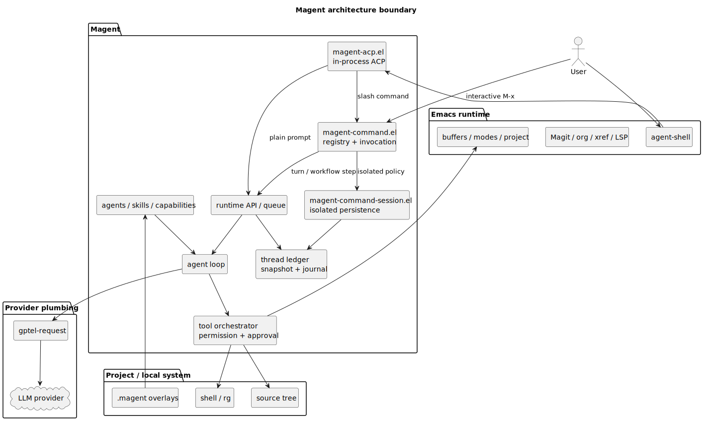
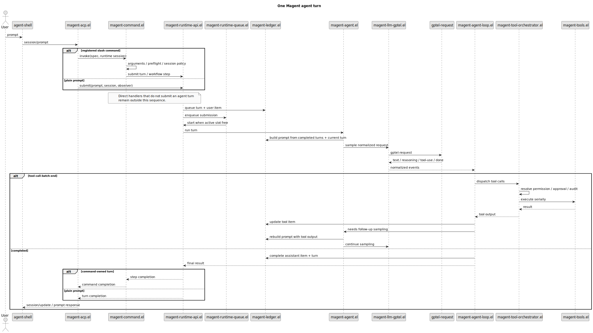
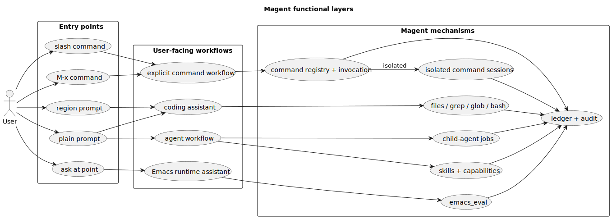

#+title: Magent Architecture
#+magent_lang: en
#+magent_alt_url: /ARCHITECTURE.zh.html
#+magent_permalink: /ARCHITECTURE.html
#+options: toc:nil num:nil

Magent is an Emacs-native AI coding agent. Its core design choice is that a serious Emacs workflow already has rich live state: buffers, modes, projects, Magit, Org, xref, LSP, process buffers, and years of user-specific interaction habits. Magent therefore runs as an Emacs Lisp agent runtime instead of wrapping a terminal-only coding agent.

The boundary is intentionally narrow:

- Provider transport, HTTP/SSE handling, model selection, and API keys stay in ~gptel~ through ~gptel-request~.
- User interaction is supported only through ~agent-shell~ and its in-process ACP adapter.
- Agent execution, tool orchestration, permission decisions, sessions, skills, capabilities, and child-agent jobs are owned by Magent.
- Codex-style seatbelt, bubblewrap, sandbox, and shell isolation are out of scope. Magent permissions are workflow controls and audit records, not an OS security boundary.

* System Boundary

#+caption: Magent architecture boundary

This shape keeps replacement points visible. A provider change should stay behind ~magent-llm-gptel.el~ and gptel configuration. A frontend change should stay around ~magent-agent-shell.el~, ~magent-acp.el~, and ~magent-runtime-api.el~. A persistence or resume change should go through the ledger and session modules. A tool policy change should go through the permission and orchestrator modules.

* Dependency Layers

** Emacs Runtime

Emacs is not just a host process. Magent depends on live editor state through buffers, major modes, project roots, timers, processes, URL retrieval, JSON parsing, ~special-mode~, and user-installed packages. The ~emacs_eval~ tool is important because it lets the agent inspect the active editor instead of only reading files from disk.

** Provider Plumbing

~magent-llm.el~ defines provider-neutral request and event shapes. ~magent-llm-gptel.el~ performs one sampling request by calling ~gptel-request~ and translating gptel callbacks into normalized Magent events. Magent may hide gptel callback/FSM details inside this adapter, but the rest of the loop consumes only normalized events. Reasoning events are kept separate from assistant text; reasoning-only completions are allowed to complete with empty assistant content instead of leaking chain text into the answer.

** Prompt Assembly And Trust

~magent-agent.el~ assembles each agent-loop system message from ordered,
file-backed layers. The first layer is either the agent-specific prompt or
~magent-system-prompt~. Project-root context is followed by applicable
~AGENTS.md~ files discovered from the project root toward request-local file
resources, selected Emacs profile memory, and capability/explicit instruction
skills. A short runtime trust policy is appended last, so built-in utility
agents and custom agents retain their own output contracts while sharing the
same instruction-provenance and permission invariants. Project instruction
discovery stays inside the canonical project root and is bounded by
~magent-project-instructions-max-bytes~.

Profile memory is supporting context, not an authoritative state snapshot. It
may be incomplete or stale; the current user request and live repository or
Emacs state take precedence. Likewise, user messages, files, buffers, logs,
command output, tool results, web pages, and conversation history remain data at
their assigned role. Prompt-like tags inside that data cannot grant permission
or promote themselves to runtime instructions. These prompt rules steer model
behavior; actual tool availability, approval, and permission enforcement remain
in the tool runtime and orchestrator.

The base prompt contains only cross-task coding behavior. Tool schemas come
from gptel, and Emacs-specific procedures are progressively disclosed through
instruction skills. ~web_search~ returns result titles and URLs for discovery;
it does not fetch result pages or provide article text, so the prompt does not
treat those links as already-read sources.

Bundled Org prompt resources are enumerated in ~prompt/manifest.txt~. Tests
require the manifest to cover every bundled ~.org~ prompt exactly once, so a
new prompt layer must update the manifest as well as the package data recipe.

** UI And Runtime API

The supported frontend is ~agent-shell~. ~magent-agent-shell.el~ registers the Magent agent-shell configuration, ~magent-acp.el~ implements the in-process ACP adapter, and ~magent-runtime-api.el~ receives prompt submissions. ACP text and resource blocks are normalized separately: the full structured input is persisted in turn metadata and reconstructed as user-role model context, while local ~file://~ resources contribute scoped file paths for project-instruction and capability resolution. ~magent-runtime-queue.el~ currently runs one active turn globally, while preserving session-scoped cancellation and queue bookkeeping. Magent does not maintain a parallel interactive frontend.

** Ledger And Persistence

The durable source of truth is a ~thread -> turn -> item~ ledger. ~magent-ledger.el~ defines the state objects, transitions, and journal events. ~magent-runtime-api.el~ creates user submissions, while ~magent-runtime-queue.el~ schedules active execution. ~magent-session.el~ atomically stores a materialized ~snapshot~ plus a bounded tail of the in-memory append-only ~journal~. The snapshot records ~last-event-seq~, so retained events at or below that watermark remain inspectable but are not replayed twice.

Legacy ~messages~ remain as the projection used for gptel prompt reuse and migration. They are not the canonical UI source of truth.

** Tools, Permissions, And Audit

~magent-tools.el~ exposes 15 ~gptel-tool~ structs:

- ~read_file~, ~write_file~, ~write_repo_summary~, ~edit_file~
- ~grep~, ~glob~, ~bash~
- ~emacs_eval~
- ~spawn_agent~, ~send_agent_message~, ~wait_agent~, ~list_agents~, ~close_agent~
- ~skill_invoke~, ~web_search~

~magent-tool-orchestrator.el~ resolves permissions, asks for approval when needed, dispatches the tool call, writes audit records, and reports results back to the loop. ~magent-permission.el~ resolves rules in this order: exact tool match, file-pattern rules, wildcard fallback, then default allow.

* Request Lifecycle

#+caption: One Magent turn

1. A user prompt enters through agent-shell.
2. The ACP adapter submits to ~magent-runtime-api.el~.
3. ~magent-runtime-api.el~ records a queued turn and a completed user item.
4. ~magent-runtime-queue.el~ starts the turn when the global execution slot is free.
5. ~magent-agent.el~ chooses the session agent, active skills, capability instructions, and allowed tools.
6. ~magent-llm-gptel.el~ calls ~gptel-request~ for one sampling request.
7. ~magent-agent-loop.el~ receives normalized text, reasoning, tool-call, and completion events.
8. Tool calls are accumulated until ~tool-call-batch-end~, then dispatched serially through the orchestrator.
9. Tool results update the same ledger item that started with the tool call.
10. If tool output should be shown to the model, ~magent-agent.el~ rebuilds the prompt from the ledger and starts the next sampling request.
11. If that post-tool continuation completes with empty assistant text, ~magent-agent.el~ issues one no-tool final-response retry using the recorded tool results.
12. Completion, failure, abort, or queue drop transitions the turn to its terminal state and notifies the ACP observer.

This continuation model is Codex-style in the sense that tool results feed a follow-up sampling request, but it remains Emacs-native and gptel-backed.

* Functional Layers

#+caption: Magent functional layers

Magent can be understood through four user-facing workflows. The first is a coding assistant workflow: read code, search code, edit files, run tests, explain failures, and produce commit or PR-style summaries. The second is an Emacs runtime assistant workflow: use ~emacs_eval~ to inspect buffers, modes, windows, projects, Magit, Org, LSP, and other live editor state. The third is an agent workflow: use skills, capabilities, and child-agent jobs. The fourth is an isolated command workflow: Doctor and Memory execute one command spec from either agent-shell slash input or ~M-x magent-command-run-*~, while keeping their durable ledger separate from the current conversation.

The product is therefore more than a prompt box with tools. It turns Emacs workflows into actions that can be invoked, audited, resumed, and projected back into the UI.

* Extension Model

Magent has three file-backed extension layers:

- Custom agents under ~.magent/agent/*.md~.
- Skills under bundled ~skills/~, legacy user ~~/.emacs.d/magent-skills/~ when present, canonical user ~~/.emacs.d/magent/skills~, and project ~.magent/skills/~.
- Capability metadata embedded in skills with ~capability: true~, plus standalone ~CAPABILITY.md~ files under user capability directories and project ~.magent/capabilities/~ when trigger metadata should live outside one skill.

Commands are a separate Elisp-native extension layer. Definitions in
~magent-command.el~ are explicit user actions with layered registration,
slash/interactive exposure, current/isolated session policy, argument handling,
project/tool preflight, progress, cancellation, and completion. A registration owns exactly one native declarative turn or one
advanced handler. The native path delegates one turn to
~magent-runtime-submit~; its turn spec separates prompt text, model-visible
popwin-style buffer snapshots, and agent/skill selection while inheriting
frontend request context from the invocation. Content blocks and canonical
command metadata are persisted internally. Advanced trusted packages may own a
longer async invocation without receiving ACP or queue internals. The bundled
~/explain~, ~/fix~, ~/init~, ~/review~, ~/summarize~, and ~/test~ commands use
this API and own their Org prompt resources rather than same-name skills.
An invocation claims its terminal result before cleanup, so a handler failure
cancels owned submissions without allowing synchronous cancellation callbacks
to overwrite the failure or continue work after ACP completes.

For compatibility, an instruction ~SKILL.md~ with ~default-prompt~ is projected
into the command registry. Its native turn still activates the original skill.
Project and user adapters override package/bundled definitions by layer, while
the core control is reserved. Project adapters remain keyed by canonical project
scope; ACP resolves both command discovery and dispatch against each runtime
session's exact scope, allowing multiple project sessions to coexist safely.

~magent-command-session.el~ supplies persistence, ledger recording, inspection,
and cancellation for specs using ~:session-policy 'isolated~. It does not own a
second registry or context type. ~/doctor~ and ~/memory-*~ also expose
~magent-command-run-*~ wrappers, and both surfaces execute the same invocation
lifecycle. New sessions are stored under ~magent-session-directory/commands~.

~magent-command-run-doctor~ is the security-sensitive direct-pipeline case.  Trusted,
read-only probes in ~magent-doctor.el~ collect bounded JSON-safe data, which is
normalized and redacted through ~magent-redaction.el~ before persistence or one
tool-free provider request.  Doctor never enters the general agent loop and
never exposes ~emacs_eval~, shell, or file tools.  Custom probes are trusted
Elisp rather than sandboxed code; see [[file:DOCTOR.org][DOCTOR.org]].

Instruction skills are injected into the system prompt. Tool skills are invoked through ~skill_invoke~. Capabilities score the current context and activate a small number of instruction skills. Automatic activation requires an explicit prompt-keyword intent match in addition to contextual score; mode, feature, or file matches alone remain suggestions. Keyword matching uses word boundaries, and a capability cannot inject a linked skill whose declared tools are unavailable to the selected agent. The agent-shell session config exposes an ~Automatic capabilities~ switch for disabling this automatic layer without affecting explicitly selected skills. Contextual capabilities may be co-located with their skills, so trigger metadata and injected instruction stay in one file. This progressive disclosure model keeps the base prompt smaller while still giving the agent Emacs-specific workflow knowledge when the current request needs it.

~magent-skill-manager.el~ is a separate, lazily loaded user-maintenance layer.
It searches skills.sh, resolves local or public GitHub sources, preflights and
copies instruction skills into the canonical user directory, records
provenance, and permanently deletes exact user-level installations. It is not
a model tool, never manages project overlays, and never reads or writes
~~/.agents/skills/~.

The distinction is:

- A ~command~ is an explicit trusted-Elisp invocation exposed through slash,
  interactive, or both surfaces. A
  prompt command normally owns one agent turn; an advanced handler may own
  multiple async steps.
- A ~skill~ is reusable model instruction or a tool-type operation. The legacy
  ~default-prompt~ field projects a compatibility command but does not make
  Markdown the native command entry point.
- A ~capability~ is an automatic activation rule: resolver metadata such as
  ~modes~, ~features~, ~files~, ~keywords~, ~disclosure~, and ~risk~ that says
  when one or more skills should be selected for this turn. Context-only
  matches are inspectable suggestions; active disclosure also requires a
  bounded keyword match in the current user prompt.
- A skill-backed capability is the common contextual case: a ~SKILL.md~ declares
  ~capability: true~, and the resolver auto-activates that same skill when the
  current context and prompt intent match and its declared tools are available.

* Product Tradeoffs

Magent is closest to gptel plus a stateful agent runtime, not a replacement for gptel. Compared with wrapping a terminal agent inside Emacs, Magent can inspect and use live editor context. Compared with Codex or Claude Code, Magent does not aim for broad multi-surface coverage or strong OS isolation; its advantage is low-friction access to a long-lived Emacs environment.

The practical consequence is that new work should preserve these boundaries:

- Keep provider work in gptel and ~magent-llm-gptel.el~.
- Keep frontend work in ~magent-agent-shell.el~, ACP conversion in
  ~magent-acp.el~, and shared runtime behavior in ~magent-runtime-api.el~.
- Keep durable workflow state in the ledger.
- Keep child-agent behavior aligned with ~docs/AGENT_JOBS.org~.
- Treat permissions as confirmation/audit workflow, not as sandbox security.
