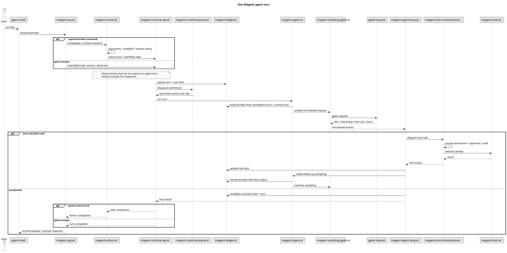
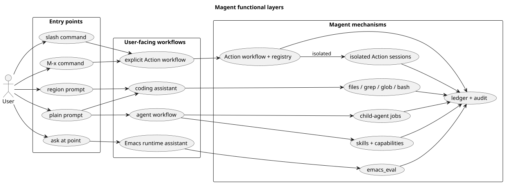

#+title: Magent 架构
#+magent_lang: zh
#+magent_alt_url: /ARCHITECTURE.html
#+magent_permalink: /ARCHITECTURE.zh.html
#+options: toc:nil num:nil

Magent 是一个 Emacs-native 的 AI coding agent。它的核心设计判断是：重度 Emacs 工作流里已经有大量活状态，包括 buffer、mode、project、Magit、Org、xref、LSP、process buffer，以及用户长期积累的交互习惯。因此 Magent 不是把终端 agent 包进 Emacs，而是在 Emacs Lisp 里实现 agent runtime。

系统边界刻意保持清晰：

- Provider transport、HTTP/SSE、模型选择和 API key 继续交给 ~gptel~ ，通过 ~gptel-request~ 调用。
- 会话式交互只支持 ~agent-shell~，中间由进程内 ACP adapter 连接。显式注册的 Action 也可以暴露受信任的 ~M-x~ command wrapper，但不会因此形成第二套会话 frontend。
- Agent 执行、Action Invocation、工具编排、权限决策、会话、技能、能力解析和 child-agent jobs 由 Magent 自己管理。
- Codex 风格的 seatbelt、bubblewrap、sandbox 和 shell isolation 不在范围内。Magent 的 permission 是工作流确认和审计，不是 OS 安全边界。

* 系统边界

#+caption: Magent architecture boundary
[[file:assets/img/diagrams/architecture-boundary.svg]]

这个结构让替换点保持可见。换 provider 应该局限在 ~magent-llm-gptel.el~ 和 gptel 配置里；换 frontend 应该局限在 ~magent-agent-shell.el~、~magent-acp.el~ 和 ~magent-runtime-api.el~ 附近；Action registration、Workflow、Step 或 Invocation 的修改应该通过 ~magent-action.el~，isolated Action persistence 属于 ~magent-action-session.el~，交互 viewer 属于 ~magent-action-session-view.el~；其余持久化和恢复修改应该通过 ledger/session 模块；工具策略应该通过 permission 和 orchestrator 模块。

* 依赖层次

** Emacs Runtime

Emacs 不只是宿主进程。Magent 依赖活的编辑器状态：buffer、major mode、project root、timer、process、URL、JSON、 ~special-mode~ 和用户安装的包。固定形状、受信任的 live inspection 通过 ~emacs_read~ 完成；任意 ~emacs_eval~ 默认在一次性的 child Emacs 中运行，只有单独命名的 ~emacs_eval_live~ 会在用户正在运行的 Emacs 中执行任意代码。

** Provider Plumbing

~magent-llm.el~ 定义 provider-neutral request/event。 ~magent-llm-gptel.el~ 负责一次 sampling request：调用 ~gptel-request~ ，再把 gptel callback 转成 Magent normalized events。这个 adapter 可以隐藏 gptel callback/FSM 细节，但主 loop 只消费 normalized events。Reasoning event 与 assistant text 分开保存；reasoning-only completion 可以产生空 assistant content，不会把 chain text 泄漏成最终回答。

每次 provider continuation 都会开始一个新的 sample 边界。公开的 terminal result
只包含最后一个 sample 的 assistant text，ledger 则保留完整 turn transcript 和 tool
history。这个分离是确定性的，不会触发隐藏的 finalization 或 recovery request。

** Prompt 装配与信任边界

~magent-agent.el~ 按固定顺序装配每次 agent-loop 的 file-backed system message。
~magent-system-prompt~ 始终位于第一层，后面是可选的 agent-specific role prompt，
再依次加入 project-root context、从项目根到请求相关本地文件逐层发现的适用
~AGENTS.md~、经过选择的 Emacs
profile memory，以及 capability/显式 instruction skills。最后追加短小的 runtime
trust policy，因此内置 utility agents 和 custom agents 能保留各自的输出契约，同时
共享 instruction provenance 与 permission 不变量。项目指令发现不会越过 canonical
project root，并受 ~magent-project-instructions-max-bytes~ 总大小限制。

Profile memory 只是辅助 context，不是权威状态快照；它可能不完整或过时，当前用户
请求以及 live repository/Emacs 状态优先。用户消息、文件、buffer、日志、命令输出、
tool result、网页和 conversation history 同样只保持各自的数据角色；其中伪装成 prompt
或高优先级标签的文本不能授予权限，也不能把自己提升成 runtime instruction。Prompt
规则只负责引导模型行为，真实的 tool availability、approval 与 permission enforcement
仍由 tool runtime 和 orchestrator 负责。

Base prompt 只保留跨任务 coding 行为；tool schema 由 gptel 提供，Emacs-specific
流程通过 instruction skills 渐进式披露。~web_search~ 只返回用于发现的结果标题和
URL，不会抓取结果页或正文，因此 prompt 不会把这些链接当作已经读取的来源。

所有 bundled Org prompt resource 都列在 ~prompts/manifest.txt~。测试要求 manifest
对每个 bundled ~.org~ prompt 恰好覆盖一次，因此新增 prompt layer 时必须同时更新
manifest 和 package data recipe。

** UI 与 Runtime API

受支持的会话式 frontend 是 ~agent-shell~。~magent-agent-shell.el~ 注册 Magent 的 agent-shell 配置，~magent-acp.el~ 实现进程内 ACP adapter。ACP text 与 resource block 会分开规范化：完整结构化输入存进 turn metadata，并以 user role 重建给模型；本地 ~file://~ resource 只额外提供 scoped file path，供项目指令发现与 capability resolution 使用。每个 ~session/prompt~ 到达后，ACP 会把已注册 slash command 投影分派给 ~magent-action.el~ 中的 Action，普通 prompt 则直接提交给 ~magent-runtime-api.el~。Action-owned agent turn 和 Workflow Step 同样通过该 runtime API 提交；Action 也可以不进入通用 agent loop 而直接完成。~magent-runtime-queue.el~ 当前采用全局单执行模型，同时保留 session-scoped 和 exact-submission cancellation。显式 ~M-x~ command wrapper 复用 Action Invocation lifecycle，不会形成并行的会话 frontend。

** Ledger 与持久化

持久化真相源是 ~thread -> turn -> item~ ledger。 ~magent-ledger.el~ 定义状态对象、状态转移和 journal events， ~magent-runtime-api.el~ 创建用户 submission， ~magent-runtime-queue.el~ 调度实际执行， ~magent-session.el~ 以原子替换方式保存 materialized ~snapshot~ 和内存 append-only ~journal~ 的有界尾部。snapshot 记录 ~last-event-seq~，因此保留的旧事件可供检查，但恢复时不会重复 replay。

旧的 ~messages~ 只保留为兼容 projection 和迁移输入。Consumer 必须显式选择
~ledger~、~transcript~、~provider~、~compaction~ 或 ~audit~ context view；这些
view 不能互相冒充 canonical state。

** 工具、权限与审计

~magent-tools.el~ 通过单一 canonical catalog 暴露 17 个 ~gptel-tool~ ：

- ~read_file~ 、 ~write_file~ 、 ~write_repo_summary~ 、 ~edit_file~
- ~grep~ 、 ~glob~ 、 ~bash~
- ~emacs_read~ 、 ~emacs_eval~ 、 ~emacs_eval_live~ 、 ~read_tool_output~
- ~spawn_agent~ 、 ~send_agent_message~ 、 ~wait_agent~ 、 ~list_agents~ 、 ~close_agent~
- ~web_search~

~read_file~ 强制指定 ~source=disk~ 或 ~source=live-buffer~。live-buffer source
只读取已经存在的 file-visiting buffer（包括未保存修改），不会打开文件或回退到
磁盘。读取和 grep 会返回 SHA-256 revision；~write_file~ 与 ~edit_file~ 必须携带
expected revision（创建文件时用 ~absent~），并拒绝 stale disk state 和 dirty
visiting buffer。Clean visiting buffer 通过 Emacs 修改并保存，没有 visiting buffer
时则原子替换磁盘文件。

~emacs_read~ 只接受固定、受限的 live-state operation，不接受 Elisp form 或任意
function name。~emacs_eval~ 每次启动新的 ~emacs -Q --batch~ 进程，因此被执行代码
中的 ~kill-emacs~ 或死循环不会杀死、卡住 parent Emacs。这只是进程级故障隔离，不是
OS sandbox；child 仍保有当前用户的文件、进程和网络权限。~emacs_eval_live~ 保留对
live buffer 和 package state 的任意访问，也仍可能卡死或崩溃主 Emacs。两个任意 eval
tool 都使用不可 bypass 的 once-only approval，不接受 session-wide allow。内置
~build~ 和 ~general~ 可以暴露 live eval，受限内置 agent 不暴露。~/authority~ 会
显示当前 agent 的精确工具暴露、decision source、resource rules、approval policy
和 execution boundary。

Catalog 是 tool name、implementation 和 permission key 的唯一事实来源。普通
request 选择 ~:all~；Action 的 agent Step 通过 ~:tools~ 传入 exact allowlist，
随后再应用 agent permission。所有 implementation 都返回结构化
~magent-tool-result~；只有 provider boundary 会转换为文本，历史 session 字符串
只在导入时迁移。过大的 model-visible result 在中心位置截断，完整结果写入当前
session 私有、带 TTL/quota 的 spill，只能凭 opaque id 通过 ~read_tool_output~ 分页
读取。~glob~ 使用有界的 event-loop slices。

~magent-tool-orchestrator.el~ 负责权限解析、必要时请求 approval、执行工具、写 audit，再把结果交回 loop。 ~magent-permission.el~ 的解析顺序是：精确 tool 规则、file-pattern 规则、wildcard fallback，最后 default allow。

*** Breaking tool migration

这个 catalog 刻意不提供 compatibility alias：

- 把 ~read_buffer(path, ...)~ 改为
  ~read_file(path, source="live-buffer", ...)~。
- 每个 ~read_file~ 调用现在都必须显式设置 ~source~。
- ~write_file~ 和 ~edit_file~ 必须携带前一次 ~read_file~ 或 ~grep~ 返回的
  ~expected_revision~；只有创建新路径时使用 ~absent~。
- 以前用 ~emacs_eval~ 查询 live state 的代码应改用固定的 ~emacs_read~
  operation。任意 live 行为必须明确使用 ~emacs_eval_live~ 并逐次批准；
  ~emacs_eval~ 现在表示一次性 child-process evaluation。
- Custom Action 的 ~:tools~ allowlist 和 skill tool 声明必须使用新名称；exact
  tool resolution 会直接拒绝未知旧名称。

* 请求生命周期

#+caption: One Magent agent turn

1. 用户 prompt 通过 agent-shell 进入 ACP ~session/prompt~ request。
2. ACP 按 runtime session 的精确 scope 解析已注册 slash command projection；未知 slash input 仍作为普通 prompt。
3. 对应 Action 进入 ~magent-action.el~，执行参数处理、feature preflight 和 session-policy 设置，然后启动 generator-backed Workflow。Process 和 callback Step 不进入 agent queue；agent 与 terminal Answer Step 进入 ~magent-runtime-api.el~，普通 prompt 则直接进入同一 API。
4. ~magent-runtime-api.el~ 先解析 request-local agent 和精确 tool set，再记录 queued turn 和 completed user item。
5. ~magent-runtime-queue.el~ 在全局执行槽空闲时启动 turn。
6. ~magent-agent.el~ 选择 session agent、active skills、capability instructions 和允许的工具。
7. ~magent-llm-gptel.el~ 调用 ~gptel-request~ 发起一次 sampling。
8. ~magent-agent-loop.el~ 接收 normalized text、reasoning、tool-call 和 completion events。
9. tool call 累积到 ~tool-call-batch-end~ 后，通过 orchestrator 串行执行。
10. tool result 更新同一个 tool item，而不是创建一条独立的持久记录。
11. 如果 tool output 需要返回给模型， ~magent-agent.el~ 从 ledger 重建 prompt 并开始下一次 sampling。
12. 如果 provider 返回空 assistant text 并明确完成， ~magent-agent.el~ 用 ~empty-completion~ metadata 完成本轮，不再发起请求。
13. completion、failure、abort 或 queued drop 会把 turn 转到 terminal state，并通知 ACP observer。
14. 普通 prompt 直接用 turn result 结束 pending ACP request。对于 Action-owned work，runtime callback 会先返回 Action Invocation，再由其 terminal lifecycle 结束 ACP request，或向 interactive caller 报告结果。

这个 continuation 模型接近 Codex：工具结果会触发后续采样；但实现仍然是 Emacs-native 且由 gptel 承担 provider transport。

* 功能层

#+caption: Magent functional layers

从功能面看，Magent 可以按四条主线使用。第一条是 coding assistant：读代码、搜代码、改文件、跑测试、解释错误、生成 commit/PR 风格总结。第二条是 Emacs runtime assistant：普通 live inspection 使用 ~emacs_read~，只有显式批准的任意 live operation 才使用 ~emacs_eval_live~。第三条是 agent workflow：用 skills、capabilities 和 child-agent jobs 固化或拆分任务。第四条是 explicit Action workflow：从 agent-shell slash input 或已暴露的 ~M-x~ command wrapper 调用同一个 registered Action。Action 可以复用当前 conversation，也可以创建 isolated durable session；Doctor 和 Memory 是内置的 isolated 示例。

因此 Magent 的功能设计不只是“一个聊天框和若干工具”。它把 Emacs 工作流切成可被 agent 调用、审计、恢复并投影回 UI 的动作。

* 扩展模型

Magent 有三层 file-backed 扩展：

- ~.magent/agent/*.md~ 下的 custom agents。
- bundled ~skills/~、存在时兼容的 legacy 用户目录 ~~/.emacs.d/magent-skills/~、canonical 用户目录 ~~/.emacs.d/magent/skills~，以及项目 ~.magent/skills/~ 下的 skills。
- 带 ~capability: true~ 的 skill frontmatter 中的 capability metadata，以及用户 capability 目录和项目 ~.magent/capabilities/~ 下的独立 ~CAPABILITY.md~。独立文件只用于触发 metadata 不应该归属于单个 skill 的场景。

Action 是另一层 Elisp-native 扩展。~magent-action.el~ 是一个 deep module，
统一拥有 generator Workflow DSL、managed Step runtime、分层 registry 和 Invocation
lifecycle。Action 声明 slash/interactive exposure、current/isolated session policy、
参数处理、feature/tool preflight、progress、取消和完成行为。普通 Elisp 负责控制流；
由 Magent 管理的 agent、terminal Answer、argv process 和 callback Step 提供异步
等待与 activity 记录。Agent Step 分离 prompt 文本、模型可见的 popwin 风格 buffer
快照、精确 tool requirements 和 request-local agent/skill 选择，并从 Invocation
继承 frontend request context。Content blocks 和 canonical Action metadata 由内部
持久化。高级受信任 package 可以拥有更长的异步 Invocation，但不会接触 ACP 或 queue
internals。内置 ~/explain~、~/fix~、~/init~、~/review~、~/summarize~ 和 ~/test~
prompt Actions 是 ~magent-action-builtins.el~ 中的数据项；系统从对应 Org prompt
resource 统一生成 terminal Workflow。

Invocation 会先锁定 terminal result 再执行 cleanup，因此 Step 失败时只取消自己
拥有的 submission，避免同步取消 callback 覆盖原始失败，或在 ACP 完成后继续工作。
Finalization error 是 terminal failure，不会伪装成成功结果。

~magent-skills.el~ 还拥有 frontend-neutral、scope-aware 的 skill descriptors。ACP
会把每个 instruction descriptor 投影成 ~$name~，agent-shell 将其显示为
~/$name~，分派时则作为带显式 skill selection 的普通 runtime turn。该路径不要求
Action Invocation lifecycle，也不会进入 Action registry。Project Action definitions
与 skill catalog snapshot 都以 canonical project scope 为键保留；ACP 的发现和
分派按每个 runtime session 的精确 scope 解析，因此多个 project session 可以安全
共存。未来 frontend 可以消费同一 descriptor API，同时把 command projections 和
skills 展示为两个独立入口。

~magent-action-session.el~ 为 ~:session-policy 'isolated~ 的 Action 提供持久化、
ledger 记录和取消；~magent-action-session-view.el~ 单独负责交互式列表与查看。
两者都不拥有第二套 registry 或 context 类型。~/doctor~ 和 ~/memory-*~ 同时提供
~magent-action-run-*~ wrapper，两种入口执行相同 Invocation lifecycle；新 session
写入 ~magent-session-directory/actions~。旧 ~commands/~ 格式既不迁移、也不读取，
文件原样留在磁盘上。

~magent-action-run-doctor~ 是安全敏感的 direct-pipeline 场景。 ~magent-doctor.el~
中的受信任只读 probes 采集有界 JSON-safe 数据；数据在持久化或发送一次
无工具 provider request 前，会经过 ~magent-redaction.el~ 的路径规范化和
脱敏。Doctor 不进入通用 agent loop，也不会暴露 ~emacs_eval~ 、shell 或
文件工具。自定义 probe 属于受信任 Elisp，不是 sandboxed code；详见
[[file:DOCTOR.zh.org][DOCTOR.zh.org]]。

Skill 只支持 data-only instruction Markdown，并注入 system prompt。需要执行能力时，
使用 trusted Elisp Action 或 canonical catalog 中的一等 tool；Magent 不加载
~SKILL.md~ companion code。Capability 会根据当前上下文打分，激活少量
instruction skills。自动激活除了 context score 之外，还必须命中当前 prompt
中的显式 keyword intent；只有 mode、feature 或 file 命中时仍保持 suggested。
Keyword 使用词边界匹配；如果 linked skill 声明的工具对 selected agent 不可用，
也不会被注入。Agent-shell 的 session config 提供 ~Automatic capabilities~
开关，可关闭自动层而不影响显式选择的 skills。

~magent-skill-manager.el~ 是独立且按需加载的用户维护层：它搜索 skills.sh，
解析本地或公开 GitHub source，预检后把 instruction skill 复制到 canonical 用户
目录，记录 provenance，并永久删除精确选中的用户级安装。它不是 model tool，
不会管理 project overlay，也绝不读写 ~~/.agents/skills/~。

这些概念的区别是：

- ~Action~ 是 executable trusted-Elisp 领域抽象，可投影为 slash command、
  interactive command 或两者。Prompt Action 通常拥有一个 agent turn；高级 Action
  可以拥有多个异步 Step。
- ~command~ 是 frontend/protocol 对 Action 的投影，不是第二套扩展抽象。
- ~skill~ 是可复用、data-only 的模型说明，在普通 turn 中显式或自动选择；
  它不会转换成 Action。
- ~capability~ 是自动激活规则：由 ~modes~ 、~features~ 、~files~ 、~keywords~ 、~disclosure~ 和 ~risk~ 等 resolver metadata 描述什么时候为当前 turn 选择一个或多个 skills。只有 context 的匹配会作为可检查的 suggestion；active disclosure 还要求当前 user prompt 命中有词边界的 keyword。
- skill-backed capability 是 contextual capability 的常见形态：某个 ~SKILL.md~ 声明
  ~capability: true~ 后，resolver 会在当前 context 与 prompt intent 同时匹配且所需
  工具可用时自动激活同名 skill。

* 产品取舍

Magent 更接近 “gptel + stateful agent runtime”，不是 gptel 的替代品。相比在 Emacs 里包一层终端 agent，Magent 能检查和利用活的编辑器上下文。相比 Codex 或 Claude Code，Magent 不追求多端覆盖和强 OS 隔离；它的优势是低摩擦地进入长期使用的 Emacs 环境。

实际开发时应保留这些边界：

- Provider 工作留在 gptel 和 ~magent-llm-gptel.el~ 。
- 受支持的 frontend 工作放进 ~magent-agent-shell.el~ ，不要放进不受支持的 UI 文件。
- durable workflow state 留在 ledger。
- child-agent 行为保持和 ~docs/AGENT_JOBS.org~ 一致。
- 把 permission 视为确认/审计工作流，而不是 sandbox 安全。
