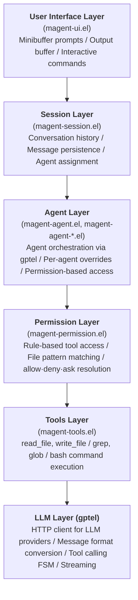

# Magent Architecture

This document describes the high-level architecture of Magent, an Emacs Lisp AI coding agent for Emacs.

## Overview

Magent is a multi-agent AI coding assistant that integrates with LLM providers via [gptel](https://github.com/karthink/gptel) to provide intelligent code assistance within Emacs. The system uses a modular architecture with clear separation of concerns across five main layers.

## System Architecture



## Core Components

### 1. Entry Point (`magent.el`)

The main entry point defines the `magent-mode` minor mode and provides the user-facing interface.

**Responsibilities:**
- Mode initialization and keybindings (`C-c o` prefix)
- Agent registry initialization
- Custom agent loading on startup
- Global mode support

**Key Functions:**
- `magent-mode`: Enable/disable the minor mode
- `global-magent-mode`: Enable globally across all buffers

### 2. Agent System

The agent system implements a multi-agent architecture where different agents have specialized capabilities and permission rules.

#### Agent Registry (`magent-agent-registry.el`)

Central registry for agent lookup and management.

**Responsibilities:**
- Store and retrieve agent definitions
- Distinguish between primary and subagents
- Provide agent listing and filtering

**Key Functions:**
- `magent-agent-registry-register`: Add agent to registry
- `magent-agent-registry-get`: Retrieve agent by name
- `magent-agent-registry-primary-agents`: List user-facing agents

#### Agent Info (`magent-agent-info.el`)

Defines the data structure for agent configuration using `cl-defstruct`.

**Structure Fields:**
- `name`: Unique agent identifier
- `description`: Human-readable description
- `mode`: `primary`, `subagent`, or `all`
- `native`: Whether built-in or custom
- `hidden`: Hide from user selection
- `prompt`: System prompt for the agent
- `permission`: Permission rules for tool access
- `temperature`, `top-p`: LLM sampling parameters
- `model`: Override default model

#### Agent Types (`magent-agent-types.el`)

Defines the seven built-in agents:

1. **build** (primary): Default agent with full tool access
2. **plan** (primary): Planning mode with restricted file edits
3. **explore** (subagent): Fast codebase exploration specialist
4. **general** (subagent): Multi-step task execution
5. **compaction** (internal): Session summarization
6. **title** (internal): Conversation title generation
7. **summary** (internal): PR-style summaries

#### Agent Processing (`magent-agent.el`)

Integrates with gptel for LLM communication and tool calling.

**Agent Processing Flow:**
1. Accept user prompt
2. Add user message to session
3. Build gptel prompt list from session history
4. Apply per-agent gptel overrides (model, temperature, backend)
5. Filter tools by agent permissions
6. Call `gptel-request` with system prompt and available tools
7. gptel's FSM manages the tool-calling loop internally
8. Callback receives final string response or error
9. Record response in session

**Key Functions:**
- `magent-agent-process`: Entry point for agent execution
- `magent-agent--make-callback`: Creates gptel callback handling all response types
- `magent-tools-get-gptel-tools`: Filter tools by agent permissions

#### Custom Agents (`magent-agent-file.el`)

Loads custom agents from `.magent/agent/*.md` files.

**File Format:**
```markdown
---
description: My custom agent
mode: primary
hidden: false
temperature: 0.5
tools:
  bash: false
  read: true
  write: true
---

Your custom system prompt here.
```

**Responsibilities:**
- Parse YAML frontmatter
- Convert to agent info structures
- Register with agent registry
- Support saving agents back to files

### 3. Permission System (`magent-permission.el`)

Rule-based access control for tools with file pattern matching.

**Permission Types:**
- `allow`: Tool is permitted
- `deny`: Tool is blocked
- `ask`: Prompt user for confirmation

**Rule Structure:**
Rules are alists that can be nested for fine-grained control:

```elisp
;; Simple tool permission
((bash . deny))

;; File-specific permissions
((read . ((\"*.env\" . deny)
          (\"*.el\" . allow)
          (\"*\" . allow))))

;; Wildcard default
((* . allow))
```

**Resolution Algorithm:**
1. Check for exact tool match
2. If tool has nested rules and file provided, check file patterns
3. Check wildcard `*` rule
4. Default to `allow`

**File Pattern Matching:**
- Glob patterns: `*.el`, `*.env.*`
- Exact paths: `/path/to/file`
- Wildcard default: `*`

### 4. Session Management (`magent-session.el`)

Manages conversation state and history.

**Session Structure:**
- `messages`: List of conversation messages
- `max-history`: Maximum messages to retain
- `id`: Unique session identifier
- `agent`: Currently assigned agent

**Message Types:**
- `user`: User prompts
- `assistant`: AI responses (text or tool uses)
- `tool`: Tool execution results

**Features:**
- Automatic history trimming
- Session persistence to `~/.emacs.d/magent-sessions/`
- Context size estimation (~4 chars per token)
- Session summarization

### 5. Tools Layer (`magent-tools.el`)

Implements the tools that agents can use to interact with the system.

**Available Tools:**

1. **read_file**: Read file contents
   - Returns file text or error message

2. **write_file**: Write content to file
   - Creates parent directories if needed
   - Returns success/error message

3. **grep**: Search files with regex
   - Recursive directory search
   - Skips `.git`, `node_modules`, etc.
   - Returns `file:line:content` format

4. **glob**: Find files by pattern
   - Supports `*` and `**` wildcards
   - Returns newline-separated paths

5. **bash**: Execute shell commands
   - Configurable timeout (default 30s)
   - Returns stdout + stderr
   - Timeout protection

**Tool Definitions:**

Each tool is registered as a `gptel-tool` struct via `gptel-make-tool`:
- `name`: Tool identifier
- `description`: What the tool does
- `args`: List of argument plists (name, type, description)
- `function`: Emacs Lisp function to execute
- `confirm`: Whether to require user confirmation (for write_file, bash)

### 6. LLM Layer (gptel)

All LLM communication is delegated to [gptel](https://github.com/karthink/gptel), an external Emacs package.

**What gptel handles:**
- HTTP communication with LLM providers (Anthropic, OpenAI, Ollama, etc.)
- Message format conversion between providers
- Tool calling FSM (the request/tool-execute/re-request loop)
- Streaming support

**What Magent handles on top of gptel:**
- Per-agent model/temperature overrides via `magent-agent-info-apply-gptel-overrides`
- Tool registration as `gptel-tool` structs with permission-based filtering
- Session history conversion to gptel prompt list format
- Callback handling for tool call display and error reporting

## Data Flow

### Typical Request Flow

1. **User Input**
   - User invokes `magent-prompt` (C-c o p)
   - Minibuffer prompts for input

2. **Session Update**
   - User message added to session
   - Session retrieves or assigns agent

3. **Agent Processing**
   - `magent-agent-process` builds gptel prompt list from session
   - Tools filtered by agent permissions into `gptel-tool` list
   - Per-agent gptel overrides applied (model, temperature)
   - `gptel-request` called with system prompt and tools

4. **gptel Tool-Calling Loop**
   - gptel sends request to LLM provider
   - If LLM returns tool calls, gptel executes them and re-requests
   - This loop is managed entirely by gptel's FSM
   - Magent's callback receives tool call notifications for UI display

5. **Completion**
   - gptel callback receives final text response
   - Response added to session
   - Output displayed to user

### Custom Agent Loading Flow

1. **Mode Activation**
   - `magent-mode` enabled
   - Agent registry initialized with built-in agents

2. **Custom Agent Discovery**
   - Scan `.magent/agent/*.md` files
   - Parse YAML frontmatter
   - Extract agent configuration

3. **Agent Registration**
   - Create `magent-agent-info` structure
   - Register with agent registry
   - Available for session assignment

## Design Decisions

### 1. Multi-Agent Architecture

**Decision:** Support multiple specialized agents rather than a single general-purpose agent.

**Rationale:**
- Different tasks benefit from different permissions (e.g., planning doesn't need file edits)
- Specialized prompts improve task-specific performance
- Users can create custom agents for their workflows

### 2. Permission-Based Access Control

**Decision:** Implement fine-grained permission system with file pattern matching.

**Rationale:**
- Security: Prevent accidental writes to sensitive files (`.env`)
- Flexibility: Different agents have different needs
- User control: `ask` permission allows user confirmation
- Extensibility: Custom agents can specify tool restrictions

### 3. Session-Based Conversations

**Decision:** Maintain conversation history in sessions rather than stateless requests.

**Rationale:**
- Context awareness: Agent can reference previous messages
- Continuity: Multi-turn tool calling requires state
- Persistence: Save and resume conversations
- Agent consistency: Keep same agent throughout session

### 4. Delegation to gptel

**Decision:** Use gptel for all LLM communication instead of a custom HTTP client.

**Rationale:**
- Leverage gptel's mature provider support (Anthropic, OpenAI, Ollama, etc.)
- gptel's FSM handles the tool-calling loop, reducing Magent's complexity
- Per-agent overrides allow model/temperature customization without reimplementing provider logic
- Users benefit from gptel's active development and provider additions

### 5. Synchronous Tool Execution

**Decision:** Execute tools synchronously within the gptel callback.

**Rationale:**
- Simplicity: Easier to reason about execution order
- Reliability: Guaranteed completion before next iteration
- Emacs threading: Limited async support in Emacs
- Future: Can add async support if needed

## Extension Points

The architecture provides several extension points:

1. **Custom Agents**: Add `.magent/agent/*.md` files
2. **New Tools**: Add `gptel-tool` structs in `magent-tools.el`
3. **New Providers**: Configure via gptel backends (no Magent changes needed)
4. **Permission Rules**: Define custom permission schemes
5. **UI Extensions**: Build on `magent-ui.el` for rich displays

## Performance Considerations

### Token Usage

- Sessions automatically trim to `magent-max-history` messages
- Context size estimation helps monitor token usage
- Consider using compaction agent for long conversations

### API Calls

- gptel manages the tool-calling loop (multiple API calls per request)
- Tool-heavy tasks use more API calls automatically
- Streaming support available through gptel

### File Operations

- Large file reads can impact performance
- Grep scans entire directory trees
- Glob uses Emacs built-in wildcards (efficient)

## Future Enhancements

Potential areas for improvement:

1. **Async Tool Execution**: Parallel tool calls
2. **Tool Caching**: Cache file reads within session
3. **Rich UI**: Dedicated buffer with formatting
4. **Token Counting**: Accurate token usage tracking
5. **Streaming Tool Results**: Stream grep/glob output
6. **Agent Delegation**: Primary agents calling subagents
7. **Plugin System**: External tool definitions
